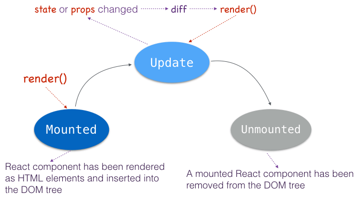
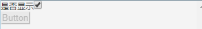
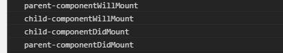
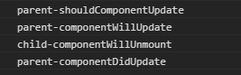
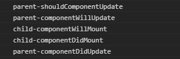
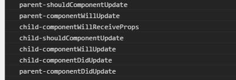

# React 组件的生命周期

## 1 生命周期

一个 React 组件在浏览器中存在以下三种状态：mounted,update,unmounted



所以 React 组件生命周期可以分为三个阶段：mounting, updating, unmounting


## 2 Mounting

React.js 在每个生命周期阶段中都对外提供特定的接口供开发者使用

### 2.1 初始化 state

ES6 语法中在 `constructor()` 方法里面设置初始化的state      

ES5 语法中在 `getInitialState()` 方法中设置初始化的state

```
const tom_and_jerry = [
    {
        name: 'Tom', 
        score: 55
    },
    {
        name: 'Jerry', 
        score: 80
    }
];

// ES6
class ScoreBoard extends React.Component {
    constructor(props) {
        super(props);
        this.state = { players: tom_and_jerry }
    }
    
    // ...
}

// ES5
var ScoreBoard = React.createClass({
    getInitialState: function() {
        return {
            players: tom_and_jerry
        }
    },
    
    // ...
});
```

初始化 `state` 的方法只会被运行一次，在组件 mounted 之前运行

### 2.2 默认 props

对于那些需要明确的 props 参数的组件，如果父组件没有定义值时，可以设置默认的 props 参数供子组件使用

```
// ES7+
class SinglePlayer extends React.Component {
    static defaultProps = {
        name: 'Nobody',
        score: 0
    }
    
    // ...
}

// ES6
class SinglePlayer extends React.Component {    
    // ...
}

SinglePlayer.defaultProps = {
    name: 'Nobody', 
    score: 0
}

// ES5
var SinglePlayer = React.createClass({
    getDefaultProps: function() {
        return {
            name: 'Nobody', 
            score: 0
        }
    }
});
```

同样设置默认 `props` 方法会在组件实例创建之前被调用一次，需要注意的是，应该避免在 `getDefaultProps()` 方法内容使用 `this.props`

### 2.3 componentWillMount()

`componentWillMount()` 方法会在组件初始渲染之前被调用，在该方法内设置 state 是个比较好的选择

```
class SinglePlayer extends React.Component {
  componentWillMount() {
    this.setState({
      isPassed: this.props.score >= 60
    });
    
    alert('componentWillMount => ' + this.props.name);
    console.log('componentWillMount => ' + this.props.name);   
  }
  
  // ...
}
```

### 2.4 componentDidMount()

`componentDidMount()` 方法会在组件初始化渲染之后被调用，在这个方法内可以进行对组件一些 DOM 操作

```
class ScoreBoard extends React.Component {
  constructor(props) {
    super(props);
    this._handleScroll = this.handleScroll.bind(this);
  }
  handleScroll() {}
  componentDidMount() {
    alert('componentDidMount in NoticeBoard');
    window.addEventListener('scroll', this._handleScroll);
  }
  
  // ...
}
```

## 3 Updating

该阶段的所有方法都不会在初始化组件的时候调用

### 3.1 componentWillReceiveProps()

> void componentWillReceiveProps(object nextProps)

`componentWillReceiveProps()` 组件接受新的 `props` 时会调用

```
class SinglePlayer extends React.Component {
  componentWillReceiveProps(nextProps) {
    // Calculate state according to props changes
    this.setState({
      isPassed: nextProps.score >= 60
    });
  }
}
```
在方法内可以访问最新状态的 `props` 对象，可以使用 `this.props` 访问上一个状态的 `props`。可以根据 `props` 的改变值来设置 `state`

### 3.2 shouldComponentUpdate()

> boolean shouldComponentUpdate(object nextProps, object nextState)

`shouldComponentUpdate()` 返回一个布尔值，为 `true` 时执行 `render()` ,否则不执行，可以通过该方法判断组件是否有重新渲染的必要。

```
class SinglePlayer extends React.Component {
  shouldComponentUpdate(nextProps, nextState) {
    // Don't rerender if score doesn't change, 
    if ( nextProps.score == this.props.score ) {
      return false;
    }

    return true;
  }
}
```

### 3.3 componentWillUpdate()

> void componentWillUpdate(object nextProps,object nextState)

该方法运行于 `shouldComponentUpdate()` 和 `render()`之间

```
class SinglePlayer extends React.Component {
  componentWillUpdate(nextProps, nextState) {
    alert('componentWillUpdate => ' + this.props.name);
    console.log('componentWillUpdate => ' + this.props.name);
  }
}
```

### 3.4 componentDidUpdate()

> void componentDidUpdate(object prevProps, object prevState)

该方法在 `render()` 后被调用，可以进行一些 DOM 操作

```
class SinglePlayer extends React.Component {
  componentDidUpdate(prevProps, prevState) {
    alert('componentDidUpdate => ' + this.props.name);
    console.log('componentDidUpdate => ' + this.props.name);
  }
}
```

## 4 Unmounting

> void componentWillUnmount()

当组件被卸载或者从DOM中移除之前会被立即调用，利用这种特性，可以执行一些清理操作。例如：接触绑定事件监听，避免内容泄露

```
class ScoreBoard extends React.Component {
  componentWillUnmount() {
    window.removeEventListener('scroll', this._handleScroll);
  }
}
```


# 实践

```
import React, {Component} from 'react';

class Button extends Component {
  constructor(props) {
    super(props);
  }

  componentWillMount() {
    console.log('child-componentWillMount');
  }

  componentDidMount() {
    console.log('child-componentDidMount');
  }

  componentWillReceiveProps() {
    console.log('child-componentWillReceiveProps');
  }

  shouldComponentUpdate() {
    console.log('child-shouldComponentUpdate');
    return true;
  }

  componentWillUpdate() {
    console.log('child-componentWillUpdate');
  }

  componentDidUpdate() {
    console.log('child-componentDidUpdate');
  }

  componentWillUnmount() {
    console.log('child-componentWillUnmount');
  }

  render() {
    return(
      <div>
        <button disabled={this.props.dis}>Button</button>
      </div>
    )
  }
}

class Test extends Component {
  constructor(props) {
    super(props);
    this.state = {
      dis: true,
      isShow: true
    }
  }

  componentWillMount() {
    console.log('parent-componentWillMount');
  }

  componentDidMount() {
    console.log('parent-componentDidMount');
  }

  componentWillReceiveProps() {
    console.log('parent-componentWillReceiveProps');
  }

  shouldComponentUpdate() {
    console.log('parent-shouldComponentUpdate');
    return true;
  }

  componentWillUpdate() {
    console.log('parent-componentWillUpdate');
  }

  componentDidUpdate() {
    console.log('parent-componentDidUpdate');
  }

  componentWillUnmount() {
    console.log('parent-componentWillUnmount');
  }
  
  handleDisChange(e) {
    this.setState((pre) => ({
      dis: !pre.dis
    }))
  }
  
  handleShowChange() {
    this.setState((pre) => ({
      isShow: !pre.isShow
    }))
  }

  render() {
    return(
      <div>
        <div>
          <label htmlFor="isShow">是否显示</label>
          <input id="isShow" type="checkbox" checked={this.state.isShow} onChange={this.handleShowChange.bind(this)} />
        </div>
        <div>
          <label htmlFor="dis">是否不可用</label>
          <input id="dis" type="checkbox" checked={this.state.dis} onChange={this.handleDisChange.bind(this)} />
        </div>
        {
          this.state.isShow && <Button dis={this.state.dis} />
        }
      </div>
    )
  }
}

export default Test;
```



>页面初始化是打印如下：  



__父组件必须在子组件 mounted 完才能完成 mounted 操作__

> 当点击是否显示复选框`隐藏`组件时打印如下：



> 当点击是否显示复选框`显示`组件时打印如下：



__子组件重新 mount__

> 当点击是否可用复选框时打印如下：



__父组件改变 state 值，理应运行 shouldComponentUpdate、componentWillUpdate、componentDidUpdate生命周期函数，但子组件不会再次 mount 而是直接 Update，即运行与父组件相同生命周期函数外还会运行  componentWillReceiveProps__
